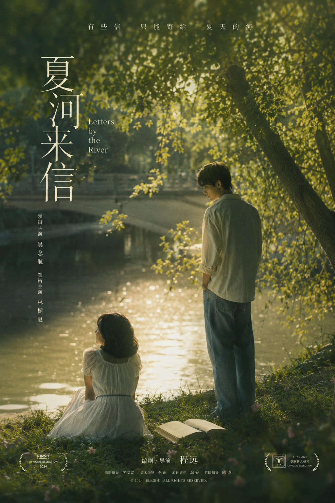
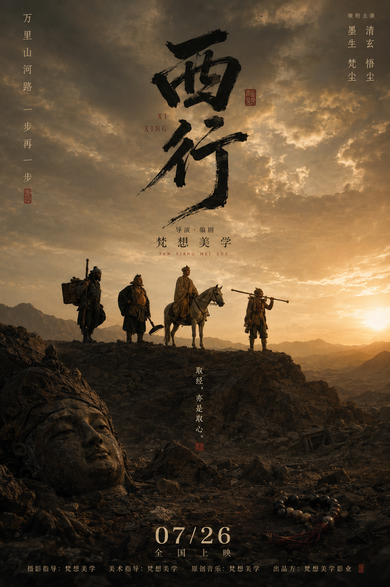
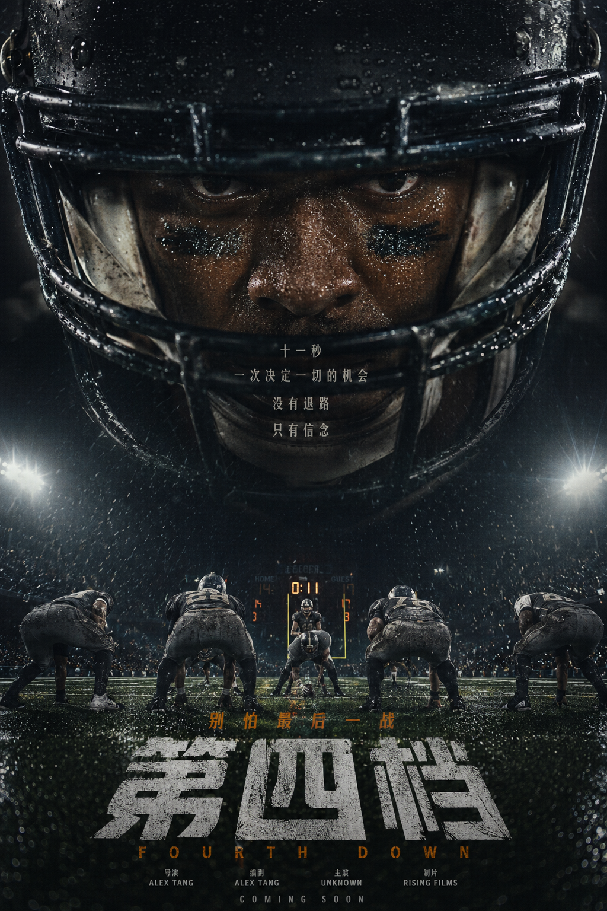
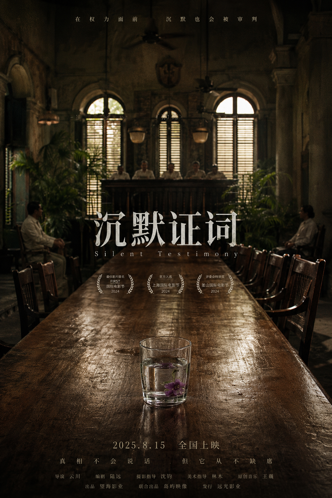
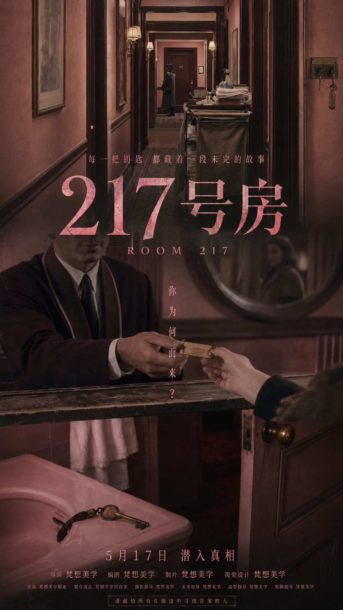
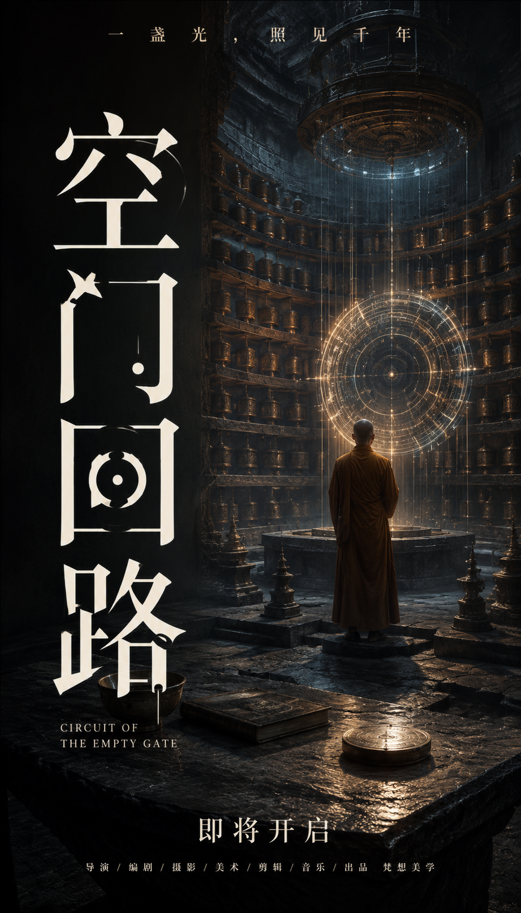

# Fantasy Movie Poster Skill

中文电影海报生成与设计指导 skill，用于把影片关键词、故事方向、剧照、三联分镜或视觉参考转译成可执行的电影海报方案与分层生成流程。

核心目标不是“剧照加标题”，而是先判断电影，再设计海报：明确类型、观众、情绪、视觉母题、标题构成和底图承载面。

## What It Does

- 进行电影海报前置分析：类型、亚类型、受众、情绪温度、核心冲突、视觉母题。
- 根据参考图提取视觉 DNA，而不是机械复刻参考图。
- 支持 9:16 中文电影海报方案、提示词、质量检查和分层生成工作流。
- 支持“底图层 / 字体图层 / 网格合成”的可复用流程。
- 强制避免真实电影节桂冠、真实片商标识、随机媒体引语和无意义小字。
- 所有虚拟制作署名统一使用“梵想美学”。

## Layered Poster Workflow

默认推荐分层流程：

1. **LLM 前置分析**  
   先判断这是一部什么电影。尤其遇到三联参考图时，要判断它是合家欢动画、文艺悬疑、运动压力片、东方权谋、科幻隔离，还是其他类型。

2. **Base Layer**  
   生成或裁切无字底图。底图必须提供文字可以“附着”的物理表面，例如幕布、玻璃、墙面、天空、桌面、地面反射、门框、头盔、球场、物件表面。

3. **Typography Layer**  
   字体图层也由图像模型单独生成，不用本地普通文字排版冒充字体设计。中文主标题必须清晰可读。

4. **Grid Composite**  
   本地只做裁切、缩放、透明度、混合模式和网格定位，不重新打字。

## Important Rule

如果参考图明显是儿童 / 合家欢 / Pixar-like 动物 IP 气质，不要把它硬改成阴郁空场文艺片。可以高级化，但不能背叛影片类型承诺。应保留角色魅力、表演能量、温暖色彩和家庭观众可进入性。

如果不能一模一样复刻参考图，就不要做“像但不准”的中间态。要么精确复现，要么做清晰的主题衍射。

## Examples

| Literary | Epic | Sports |
| --- | --- | --- |
|  |  |  |

| Institutional | Suspense | Poster |
| --- | --- | --- |
|  |  |  |

## Repository Structure

```text
fantasy-movie-poster/
  SKILL.md
  manifest.json
  references/
    layered-cover-workflow.md
    genre-presets.md
    typography-system.md
    composition-models.md
    quality-control.md
  scripts/
    build_prompt.py
    composite_layers.py
    validate_project.py
    validate_poster_text.py
    validate_skill.py
  templates/
  assets/
  examples/
```

## Scripts

Composite a base layer and a typography layer:

```powershell
python scripts/composite_layers.py `
  --base path/to/base.png `
  --type path/to/type.png `
  --out path/to/composite.png `
  --grid-out path/to/grid.json `
  --canvas 1024x1792 `
  --type-box 0,0,1,1 `
  --mode screen `
  --opacity 0.95
```

Validate the skill package:

```powershell
python scripts/validate_skill.py
```

## Design Notes

- 默认画幅：9:16。
- 中文标题优先，英文副标题只做辅助节奏。
- 标题可以成为主视觉，占据 30%-60% 的画面，但必须服务叙事。
- 底图应低到中等对比，避免脏黑、重 HDR、恐怖片化和无意义颗粒。
- 不自动保留三联画结构，除非用户明确要求。

## License

Personal / experimental skill package. Add a formal license before public reuse if needed.
